# Machine Learning and Statistical Inference for Cross-Sectional Asset Returns

*Generated from `results/` by `scripts/07_report.py`. Every number below is read
from a result file; none is transcribed.*

---

## Summary

**Question.** Do nonlinear machine-learning models add out-of-sample predictive
information about cross-sectional equity returns beyond regularised linear
models — and if so, does it survive transaction costs, factor controls, and a
correction for the number of hypotheses the literature has tested?

**Setting.** 374 value-weighted characteristic-sorted portfolios of
US common stocks, 248,614 asset-months,
26 point-in-time predictors, 34 annual refits
on an expanding window, 407 out-of-sample months from
1990-01 to 2023-11.

**Five findings.**

1. **The gain from complexity is sparsity, not nonlinearity.** Rank IC rises
   monotonically from 0.0254 for a single
   momentum characteristic to 0.0316 for ridge
   to 0.0493 for xgboost
   (*t* = 3.64 against zero). But in a
   paired test xgboost beats ridge
   (*t* = 2.37) and does **not** beat
   enet, the best linear model
   (*t* = 1.46,
   *p* = 0.14). The neural network
   is significantly *worse* than enet on squared error.
2. The accuracy ranking is not the tradability ranking. Ridge breaks even at
   18 bps one-way and turns
   negative at 20; xgboost breaks even at
   32 bps; and the one-line
   baseline, which trades least, breaks even highest of all at
   42 bps.
3. The alpha is real and unremarkable in context. xgboost earns
   7.0% a year against the six-factor model
   (*t* = 2.83), but its own *t* of
   3.43 sits at the
   57th percentile of
   212 published predictors and does **not** survive Bonferroni.
4. Experiment 4 refuted its own hypothesis. GRS does not degrade as *N/T* → 1;
   what fails is its asymptotic counterpart, shrinkage without a recalibrated
   reference, and the large-*N* alternative under real cross-sectional
   dependence.
5. Predictability decays across the sample, for every model.

---

## 1. Data

### 1.1 Cross-section

| family                       |   assets | first_month   | last_month   |   mean_monthly_return |
|:-----------------------------|---------:|:--------------|:-------------|----------------------:|
| 25_Portfolios_5x5            |       25 | 1963-07       | 2023-12      |                0.0111 |
| 25_Portfolios_BEME_INV_5x5   |       25 | 1963-07       | 2023-12      |                0.0105 |
| 25_Portfolios_BEME_OP_5x5    |       25 | 1963-07       | 2023-12      |                0.0102 |
| 25_Portfolios_ME_AC_5x5      |       25 | 1963-07       | 2023-12      |                0.0110 |
| 25_Portfolios_ME_BETA_5x5    |       25 | 1963-07       | 2023-12      |                0.0112 |
| 25_Portfolios_ME_INV_5x5     |       25 | 1963-07       | 2023-12      |                0.0112 |
| 25_Portfolios_ME_NI_5x5      |       25 | 1963-07       | 2023-12      |                0.0105 |
| 25_Portfolios_ME_OP_5x5      |       25 | 1963-07       | 2023-12      |                0.0109 |
| 25_Portfolios_ME_Prior_12_2  |       25 | 1963-07       | 2023-12      |                0.0107 |
| 25_Portfolios_ME_Prior_1_0   |       25 | 1963-07       | 2023-12      |                0.0106 |
| 25_Portfolios_ME_Prior_60_13 |       25 | 1963-07       | 2023-12      |                0.0116 |
| 25_Portfolios_ME_VAR_5x5     |       25 | 1963-07       | 2023-12      |                0.0111 |
| 25_Portfolios_OP_INV_5x5     |       25 | 1963-07       | 2023-12      |                0.0100 |
| 49_Industry_Portfolios       |       49 | 1963-07       | 2023-12      |                0.0102 |

All returns are value-weighted monthly returns on portfolios of NYSE, AMEX and
NASDAQ common stocks from the Kenneth French data library, in decimal form.
Sample 1963-07 to 2023-12. The negative and zero
net-share-issues buckets are dropped because they are categorical rather than
points on an ordered sort, so they are not comparable across the cross-section.

### 1.2 Factors

| factor   |   mean_pct_per_month |   sd_pct_per_month |   n_months |
|:---------|---------------------:|-------------------:|-----------:|
| mktrf    |                0.568 |              4.497 |    726.000 |
| smb      |                0.215 |              3.033 |    726.000 |
| hml      |                0.292 |              2.995 |    726.000 |
| rmw      |                0.283 |              2.225 |    726.000 |
| cma      |                0.273 |              2.077 |    726.000 |
| rf       |                0.363 |              0.266 |    726.000 |
| mom      |                0.600 |              4.213 |    726.000 |

Mkt-RF at 0.57% and momentum at
0.60% per month match published values,
matching published values, which is how the mirrored files are checked against
the primary source.

### 1.3 What this data cannot support

The cross-section is portfolios, not firms. Accounting characteristics are not
observable per portfolio, so all 26 predictors are derived
from returns, plus three static labels giving each asset's place in its sort.
Nonlinear interactions **between firm characteristics** — the mechanism Gu,
Kelly and Xiu (2020) identify as the main source of machine-learning gains —
largely cannot be represented here. Read what follows as a lower bound on what
this pipeline would find on a firm-level panel. `docs/METHODOLOGY.md` §8 lists
the rest.

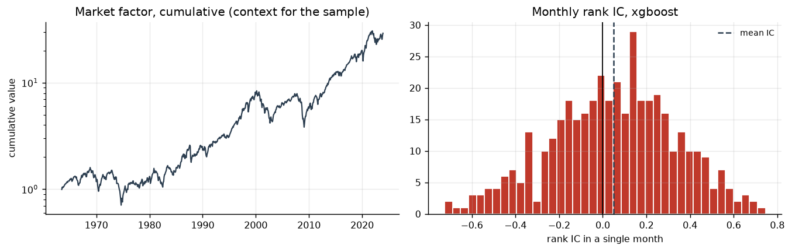

*Market factor over the sample, and the distribution of monthly rank IC for the best model*


---

## 2. Method

Detail in `docs/METHODOLOGY.md`. The four things that matter most:

- **Target.** Next month's excess return, demeaned and scaled within the month.
  Demeaning removes the market, which dominates return variance and is
  essentially unforecastable monthly, and leaves what a long-short book trades.
- **Splits by time and by whole month.** Random folds would train on the future,
  and — less obviously — would leak a month's common shock across the split,
  since average pairwise residual correlation here is
  0.048 with a 90th percentile of
  0.22. One month is embargoed from the end of
  the training and validation blocks because labels reach forward.
- **Hyper-parameters chosen on a validation block** that precedes the test year,
  inside each model's own `fit`, so the harness cannot leak.
- **Leakage is tested.** Corrupting returns after a cutoff must leave earlier
  predictors bit-for-bit identical; permuting labels within months must drive
  measured skill inside its sampling error; and a deliberate leak must show up
  clearly, so that the null control means something.

---

## 3. Experiment 1 — does flexibility buy accuracy?

| model         |   rank_ic |   rank_ic_tstat |   rank_ic_std |   icir |   pearson_ic |   hit_rate |   r2_oos |   calibration_slope |   n_months |   dm_tstat_vs_ridge |   dm_tstat_vs_best_linear |
|:--------------|----------:|----------------:|--------------:|-------:|-------------:|-----------:|---------:|--------------------:|-----------:|--------------------:|--------------------------:|
| single-signal |    0.0254 |          1.5765 |        0.3167 | 0.0803 |       0.0291 |     0.5283 |  -0.3022 |              0.0503 |   407.0000 |             18.5606 |                   18.1642 |
| ols           |    0.0316 |          2.2176 |        0.2770 | 0.1140 |       0.0352 |     0.5627 |  -0.0070 |              0.3088 |   407.0000 |              3.4219 |                    3.7503 |
| ridge         |    0.0316 |          2.2180 |        0.2770 | 0.1140 |       0.0352 |     0.5627 |  -0.0070 |              0.3088 |   407.0000 |            nan      |                    3.7499 |
| lasso         |    0.0423 |          3.2327 |        0.2638 | 0.1604 |       0.0441 |     0.4791 |   0.0022 |              0.7049 |   407.0000 |             -3.9066 |                   -0.2269 |
| enet          |    0.0432 |          3.0907 |        0.2795 | 0.1547 |       0.0458 |     0.5283 |   0.0021 |              0.6855 |   407.0000 |             -3.7499 |                  nan      |
| xgboost       |    0.0493 |          3.6371 |        0.2860 | 0.1722 |       0.0532 |     0.5848 |   0.0023 |              0.6720 |   407.0000 |             -4.4080 |                   -0.2971 |
| neural-net    |    0.0317 |          2.1595 |        0.2876 | 0.1102 |       0.0372 |     0.5651 |  -0.0014 |              0.4228 |   407.0000 |             -3.1252 |                    2.5996 |

**The point estimates rise monotonically along the ladder** — single-signal
0.0254, ridge
0.0316, lasso
0.0423, xgboost
0.0493 — which invites the conclusion that
complexity pays. That conclusion does not survive a paired test.

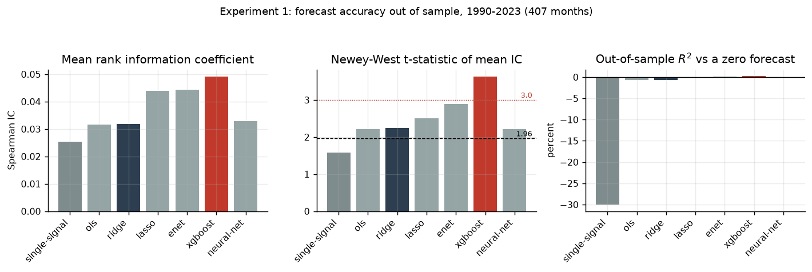

*Experiment 1: mean rank IC, its Newey-West t-statistic, and out-of-sample R-squared across the model ladder*


### 3.1 The gain is sparsity, not nonlinearity

Both models face the same cross-section every month, so their monthly ICs can
be differenced pairwise. The common component cancels and the resulting test is
far tighter than comparing two standard errors. `ic_diff_tstat` tests the
rank-IC gap; `dm_tstat_squared_error` is Diebold-Mariano on squared error, where
negative favours the row.

**Each step of the ladder against the step below it:**

| comparison            |   ic_model |   ic_benchmark |   ic_difference |   ic_diff_tstat |   ic_diff_pvalue |   dm_tstat_squared_error |   dm_pvalue |
|:----------------------|-----------:|---------------:|----------------:|----------------:|-----------------:|-------------------------:|------------:|
| ols vs single-signal  |     0.0316 |         0.0254 |          0.0061 |          0.4444 |           0.6568 |                 -18.5605 |      0.0000 |
| ridge vs ols          |     0.0316 |         0.0316 |          0.0000 |          1.9276 |           0.0539 |                  -3.4219 |      0.0006 |
| lasso vs ridge        |     0.0423 |         0.0316 |          0.0107 |          1.2331 |           0.2176 |                  -3.9066 |      0.0001 |
| enet vs lasso         |     0.0432 |         0.0423 |          0.0009 |          0.1947 |           0.8456 |                   0.2269 |      0.8205 |
| xgboost vs enet       |     0.0493 |         0.0432 |          0.0060 |          1.4609 |           0.1440 |                  -0.2971 |      0.7664 |
| neural-net vs xgboost |     0.0317 |         0.0493 |         -0.0176 |         -2.9832 |           0.0029 |                   3.5551 |      0.0004 |


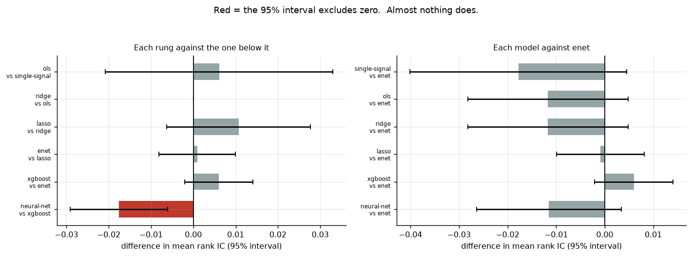

*Differences in mean rank IC with 95% intervals. Almost every interval crosses zero.*


**Not one adjacent step is a significant improvement.** The only significant row
is the last, and it goes the wrong way: the neural network is significantly
*worse* than boosting. Every rung of the ladder is small relative to its own
standard error; only the cumulative distance covers enough ground to be
detected.

One row needs care. `ridge` versus `ols` has an IC difference of
+0.00000 — economically nothing — and yet
*t* = 1.93. Ridge's validated penalty
is so small that it reproduces OLS almost exactly, so the paired difference is
minuscule but almost perfectly consistent in sign, which is all a *t*-statistic
needs. Significance without an effect size means nothing.

**Everything against `enet`, the best linear model:**

| comparison            |   ic_model |   ic_benchmark |   ic_difference |   ic_diff_tstat |   ic_diff_pvalue |   dm_tstat_squared_error |   dm_pvalue |
|:----------------------|-----------:|---------------:|----------------:|----------------:|-----------------:|-------------------------:|------------:|
| xgboost vs enet       |     0.0493 |         0.0432 |          0.0060 |          1.4609 |           0.1440 |                  -0.2971 |      0.7664 |
| single-signal vs enet |     0.0254 |         0.0432 |         -0.0178 |         -1.5650 |           0.1176 |                  18.1642 |      0.0000 |
| ols vs enet           |     0.0316 |         0.0432 |         -0.0117 |         -1.3882 |           0.1651 |                   3.7503 |      0.0002 |
| ridge vs enet         |     0.0316 |         0.0432 |         -0.0117 |         -1.3877 |           0.1652 |                   3.7499 |      0.0002 |
| lasso vs enet         |     0.0423 |         0.0432 |         -0.0009 |         -0.1947 |           0.8456 |                  -0.2269 |      0.8205 |
| neural-net vs enet    |     0.0317 |         0.0432 |         -0.0115 |         -1.5148 |           0.1298 |                   2.5996 |      0.0093 |

Read that alongside the comparison against ridge:

- **xgboost beats ridge**: IC gap
  +0.0177,
  *t* = 2.37; Diebold-Mariano
  *t* = -4.41.
- **xgboost does *not* beat enet**: IC gap only
  +0.0060,
  *t* = 1.46
  (*p* = 0.14), and on squared
  error *t* = -0.30
  (*p* = 0.77) — indistinguishable.
- **The neural network is *worse* than enet**: IC gap
  -0.0115, and on squared
  error it loses significantly
  (*t* = +2.60,
  *p* = 0.009).

So the answer to the project's stated question is **no, not reliably**. What
separates ridge from boosting is almost entirely the sparse regularisation in
between: ridge selects a penalty so small it is effectively OLS — with
26 predictors and 248,614 observations
there is no ill-conditioning for shrinkage to fix — whereas the sparse variable
selection in Lasso and elastic net is a real restriction that pays out of
sample. Adding nonlinearity on top of that buys a further
+0.0060 of IC, which is not
distinguishable from zero.

Note also that no *single adjacent* step in the ladder is significant on its
own. Only the cumulative gap from ridge to xgboost clears conventional
significance.

That the network trails is the expected outcome for 374 assets and
26 return-based predictors: boosting at depth 2 to 4 fits
low-order interactions, about the amount of structure this data supports,
whereas a network must learn a representation from the same thin signal. It is
not evidence about networks in general, and on a firm-level panel with hundreds
of characteristics the literature finds the opposite.

**On the negative out-of-sample R².** IC and R² measure different things, and
the gap is diagnosable rather than contradictory. IC asks whether the *ordering*
is informative; R² asks whether the forecast is the right *size*. The
calibration slope — the coefficient from regressing outcome on forecast out of
sample — is 0.31 for ridge, meaning
its forecasts are roughly 3.2
times too large, and 0.67 for xgboost.
The better-calibrated models are exactly the ones with positive R². Since the
portfolio uses only the ranking, IC is the metric that matters here — but
reporting IC alone would have hidden a real miscalibration.

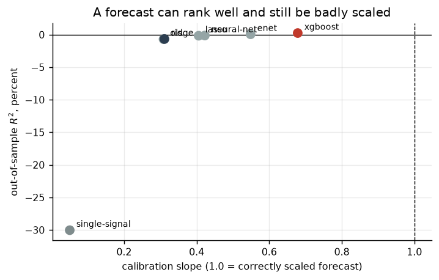

*Models with a calibration slope near one are exactly those with positive out-of-sample R-squared*


**Accuracy by decade.**

| decade   |   single-signal |     ols |   ridge |   lasso |   enet |   xgboost |   neural-net |
|:---------|----------------:|--------:|--------:|--------:|-------:|----------:|-------------:|
| 1990s    |          0.0436 |  0.0781 |  0.0781 |  0.0729 | 0.0751 |    0.0701 |       0.0651 |
| 2000s    |          0.0247 |  0.0420 |  0.0420 |  0.0599 | 0.0573 |    0.0643 |       0.0398 |
| 2010s    |          0.0210 | -0.0184 | -0.0184 |  0.0111 | 0.0056 |    0.0225 |       0.0041 |
| 2020s    |         -0.0078 |  0.0136 |  0.0136 | -0.0008 | 0.0222 |    0.0259 |      -0.0038 |

Every model weakens over the sample. Two readings, which this design cannot
separate: either these relations were arbitraged away as they became known — the
pattern the anomaly-decay literature would predict — or the early result was
partly luck. This is the main reason the full-sample *t*-statistic matters more
here than the point estimate.

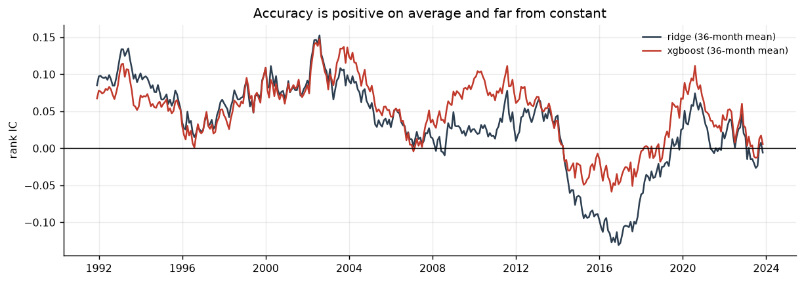

*Rolling 36-month mean rank IC: positive on average, far from constant*


---

## 4. Experiment 2 — is it worth anything after costs?

|                           |   single-signal |    ols |   ridge |   lasso |   enet |   xgboost |   neural-net |
|:--------------------------|----------------:|-------:|--------:|--------:|-------:|----------:|-------------:|
| turnover_monthly          |           1.030 |  2.313 |   2.313 |   1.829 |  1.871 |     1.956 |        1.803 |
| turnover_fraction_of_book |           0.258 |  0.578 |   0.578 |   0.457 |  0.468 |     0.489 |        0.451 |
| ann_return_gross          |           0.051 |  0.051 |   0.051 |   0.064 |  0.071 |     0.076 |        0.050 |
| ann_vol                   |           0.155 |  0.125 |   0.125 |   0.128 |  0.134 |     0.141 |        0.133 |
| sharpe_gross              |           0.332 |  0.408 |   0.408 |   0.503 |  0.526 |     0.538 |        0.375 |
| max_drawdown_gross        |          -0.485 | -0.366 |  -0.366 |  -0.337 | -0.310 |    -0.326 |       -0.308 |
| hit_rate                  |           0.553 |  0.587 |   0.587 |   0.509 |  0.555 |     0.592 |        0.590 |
| sharpe_net_5bps           |           0.292 |  0.298 |   0.298 |   0.418 |  0.443 |     0.455 |        0.293 |
| ann_return_net_5bps       |           0.045 |  0.037 |   0.037 |   0.053 |  0.059 |     0.064 |        0.039 |
| sharpe_net_10bps          |           0.252 |  0.187 |   0.187 |   0.332 |  0.359 |     0.372 |        0.212 |
| ann_return_net_10bps      |           0.039 |  0.023 |   0.023 |   0.042 |  0.048 |     0.052 |        0.028 |
| sharpe_net_20bps          |           0.172 | -0.035 |  -0.035 |   0.160 |  0.192 |     0.205 |        0.050 |
| ann_return_net_20bps      |           0.027 | -0.004 |  -0.004 |   0.020 |  0.026 |     0.029 |        0.007 |
| breakeven_cost_bps        |          41.591 | 18.438 |  18.445 |  29.292 | 31.462 |    32.350 |       23.052 |

Turnover is two-sided: replacing both legs in full is 4.0, so
`turnover_fraction_of_book` reports the share replaced per month. Costs are a
one-way rate applied to turnover.

**The ranking reverses.** By gross Sharpe the order is roughly xgboost >
enet > ridge > baseline. By break-even cost it is nearly inverted: the
single-characteristic baseline absorbs
42 bps before its edge
disappears — the most of any model — because it turns over
1.03 against ridge's
2.31. Ridge and OLS are *negative*
at 20 bps.

The reversal only appears if turnover is charged for before models are
compared. Stopping at gross Sharpe would have put penalised linear models ahead
of a one-line signal; after costs they are behind it.

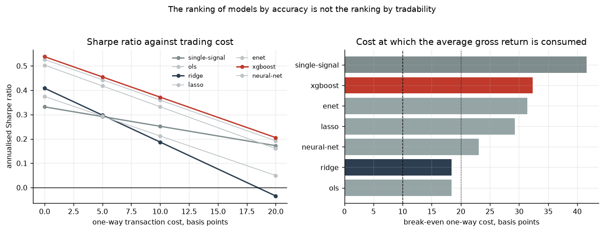

*Sharpe ratio against trading cost, and the break-even cost per model*


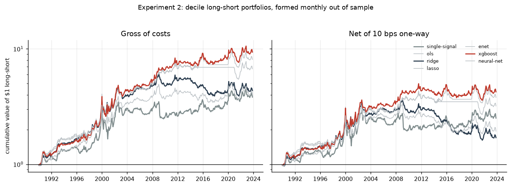

*Cumulative long-short performance, gross and net of 10 bps*


**Monotonicity.** Realised annualised excess return by predicted decile:

|   predicted_decile |   single-signal |   ols |   ridge |   lasso |   enet |   xgboost |   neural-net |
|-------------------:|----------------:|------:|--------:|--------:|-------:|----------:|-------------:|
|                  0 |            6.90 |  6.79 |    6.79 |    4.56 |   5.02 |      5.64 |         6.71 |
|                  1 |            8.60 |  8.62 |    8.62 |    7.02 |   8.63 |      8.00 |         9.23 |
|                  2 |            9.74 |  9.50 |    9.50 |    9.07 |   9.29 |      8.67 |         9.49 |
|                  3 |           10.06 |  9.56 |    9.56 |    9.20 |   9.71 |     10.14 |         9.67 |
|                  4 |           10.02 | 10.36 |   10.36 |    9.29 |  10.02 |      9.73 |         9.99 |
|                  5 |           10.34 |  9.99 |    9.98 |    9.78 |  10.52 |     10.03 |        10.17 |
|                  6 |           10.32 | 10.50 |   10.51 |   10.02 |  10.84 |     10.59 |        10.48 |
|                  7 |           10.12 | 10.75 |   10.74 |   10.63 |  11.76 |     11.46 |        10.73 |
|                  8 |           10.78 | 10.94 |   10.94 |   11.02 |  11.68 |     11.40 |        10.76 |
|                  9 |           12.04 | 11.91 |   11.91 |   12.37 |  12.77 |     13.23 |        11.70 |

A monotone profile is much stronger evidence than a good top-minus-bottom
spread, which two lucky buckets can produce on their own.

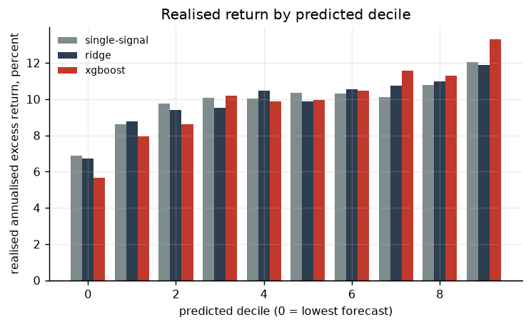

*Realised annualised excess return by predicted decile*


---

## 5. Experiment 5 — attribution and robustness

*Presented before Experiment 3 because it bears on how much of the signal there
is to test.*

### 5.1 Which predictors carry the signal

Each row refits the entire walk-forward. `ic_change_when_removed` is negative
when dropping a group hurts. Feature importances from the fitted model are
deliberately not used: they describe a fit, not out-of-sample value.

| predictor_set   |   ic_without_group |   ic_change_when_removed |   ic_with_group_alone |   sharpe_without_group |   sharpe_with_group_alone |
|:----------------|-------------------:|-------------------------:|----------------------:|-----------------------:|--------------------------:|
| trend           |             0.0385 |                  -0.0108 |                0.0443 |                 0.4534 |                    0.4824 |
| reversal        |             0.0432 |                  -0.0061 |                0.0195 |                 0.4467 |                    0.2234 |
| comovement      |             0.0433 |                  -0.0060 |                0.0168 |                 0.4617 |                    0.0699 |
| volatility      |             0.0437 |                  -0.0056 |                0.0129 |                 0.5326 |                    0.1122 |
| seasonality     |             0.0463 |                  -0.0030 |                0.0041 |                 0.5302 |                   -0.0076 |
| persistence     |             0.0470 |                  -0.0023 |                0.0018 |                 0.5398 |                   -0.0169 |
| momentum        |             0.0473 |                  -0.0020 |                0.0228 |                 0.5633 |                    0.3306 |
| static          |             0.0473 |                  -0.0020 |                0.0115 |                 0.5317 |                    0.0978 |
| higher_moments  |             0.0497 |                   0.0004 |                0.0081 |                 0.5675 |                    0.0818 |

Full predictor set: rank IC 0.0493.

Removing **trend** costs the most
(-0.0108). The group that
does best on its own is **trend**
(IC 0.0443 alone, against
0.0493 for everything together).

**The two columns disagree.** Look at
**momentum**: removing it costs almost nothing
(-0.0020, among the
smallest in the table), yet on its own it delivers
0.0228 — second only to
trend. A leave-one-out study alone would have concluded that
momentum contains no information. What it actually shows is that
momentum is *substitutable*: the other predictors already span most of
what it knows. Those are different claims, and only the second is true.

The reverse case is **higher_moments**, where removing the group leaves the result
unchanged or slightly better
(+0.0004) *and* it is close to
useless alone (0.0081). That is a
group carrying no information, which is a genuine finding rather than an
artefact of redundancy — and it is only distinguishable from the
momentum case because both columns were computed.

**The signal is concentrated, not spread.** `trend` on its own reaches
0.0443 of the
0.0493 available from all 26 predictors — so most of
what the model knows comes from a handful of trailing-drawdown and
risk-adjusted-momentum measures rather than from combining many weak signals.
Three groups contribute essentially nothing on their own
(persistence, seasonality, higher_moments), and dropping
them does not hurt.

**And attribution interacts with cost.** Dropping `reversal` costs
0.0061 of IC but
raises the break-even cost from
32 to
49 bps,
because that group is what drives the turnover. A predictor group can be
informative and still not be worth trading, which is invisible to any
importance measure that ignores the portfolio.

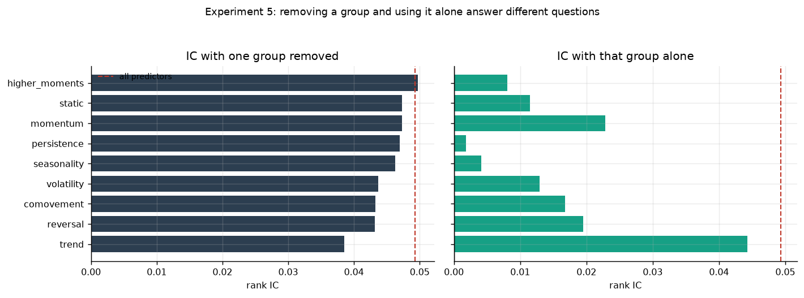

*Removing a predictor group and using it alone answer different questions*


### 5.2 Design choices

Each row changes exactly one decision away from the default.

| variant                  |   rank_ic |   rank_ic_tstat |   icir |   sharpe_gross |   sharpe_net_10bps |   turnover_monthly |   breakeven_cost_bps |   n_months |
|:-------------------------|----------:|----------------:|-------:|---------------:|-------------------:|-------------------:|---------------------:|-----------:|
| default                  |    0.0493 |          3.6371 | 0.1722 |         0.5380 |             0.3717 |             1.9555 |              32.3504 |   407.0000 |
| rolling_20y_window       |    0.0461 |          3.5933 | 0.1748 |         0.5757 |             0.3996 |             1.8253 |              32.7395 |   407.0000 |
| rolling_10y_window       |    0.0286 |          2.5905 | 0.1178 |         0.3856 |             0.2055 |             1.7835 |              21.3781 |   407.0000 |
| quintile_portfolios      |    0.0493 |          3.6371 | 0.1722 |         0.4913 |             0.3261 |             1.5480 |              29.7104 |   407.0000 |
| ventile_portfolios       |    0.0493 |          3.6371 | 0.1722 |         0.5570 |             0.3986 |             2.1619 |              35.0931 |   407.0000 |
| rank_weighted_all_assets |    0.0493 |          3.6371 | 0.1722 |         0.4845 |             0.3129 |             1.2765 |              28.2185 |   407.0000 |

**This answers "why expanding rather than rolling".** A 20-year rolling window
performs essentially the same as expanding
(IC 0.0461 against
0.0493; Sharpe
0.58 against
0.54). A 10-year window is clearly worse
(IC 0.0286, Sharpe
0.39). Degradation as the
window shrinks, and flatness between 20 years and everything, is the evidence
that estimation error binds rather than non-stationarity. Note the honest
caveat: 20-year rolling is marginally better on Sharpe, so the choice is within
noise rather than obviously right.

Portfolio cutoffs behave as expected — concentrating into narrower buckets
raises gross Sharpe and turnover together — and rank weighting across the whole
cross-section gives up some gross Sharpe for materially lower turnover.

### 5.3 Subperiods and regimes

| period    |   enet |   lasso |   neural-net |     ols |   ridge |   single-signal |   xgboost |
|:----------|-------:|--------:|-------------:|--------:|--------:|----------------:|----------:|
| 1990-1999 | 0.0751 |  0.0729 |       0.0651 |  0.0781 |  0.0781 |          0.0436 |    0.0701 |
| 2000-2009 | 0.0573 |  0.0599 |       0.0398 |  0.0420 |  0.0420 |          0.0247 |    0.0643 |
| 2010-2023 | 0.0103 |  0.0078 |       0.0019 | -0.0094 | -0.0094 |          0.0129 |    0.0235 |

Regime labels use only information available before the month begins, so a split
is something a strategy could have conditioned on. Splitting on contemporaneous
volatility would be a different and much easier exercise.

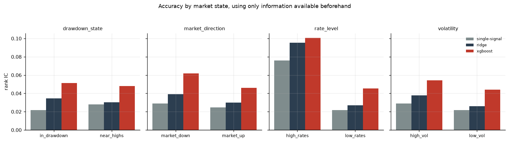

*Rank IC by market state, labelled using only prior information*


| dimension / state                             |   enet |   lasso |   neural-net |    ols |   ridge |   single-signal |   xgboost |
|:----------------------------------------------|-------:|--------:|-------------:|-------:|--------:|----------------:|----------:|
| dimension=drawdown_state, state=in_drawdown   | 0.0457 |  0.0449 |       0.0277 | 0.0343 |  0.0343 |          0.0216 |    0.0517 |
| dimension=drawdown_state, state=near_highs    | 0.0417 |  0.0407 |       0.0343 | 0.0298 |  0.0298 |          0.0279 |    0.0477 |
| dimension=market_direction, state=market_down | 0.0583 |  0.0706 |       0.0266 | 0.0391 |  0.0391 |          0.0289 |    0.0625 |
| dimension=market_direction, state=market_up   | 0.0394 |  0.0351 |       0.0330 | 0.0297 |  0.0297 |          0.0246 |    0.0459 |
| dimension=rate_level, state=high_rates        | 0.0951 |  0.0979 |       0.0547 | 0.0963 |  0.0963 |          0.0761 |    0.1007 |
| dimension=rate_level, state=low_rates         | 0.0394 |  0.0382 |       0.0300 | 0.0268 |  0.0268 |          0.0217 |    0.0455 |
| dimension=volatility, state=high_vol          | 0.0471 |  0.0500 |       0.0326 | 0.0375 |  0.0375 |          0.0291 |    0.0544 |
| dimension=volatility, state=low_vol           | 0.0395 |  0.0349 |       0.0308 | 0.0258 |  0.0258 |          0.0218 |    0.0442 |

---

## 6. Experiment 3 — is the signal statistically real?

### 6.1 Factor alphas

Six-factor (FF5 + momentum) regressions on gross long-short returns,
Newey-West 6 lags:

| model         |   alpha_annual |   alpha_tstat |     r2 |   beta_mktrf |   beta_smb |   beta_hml |   beta_mom |
|:--------------|---------------:|--------------:|-------:|-------------:|-----------:|-----------:|-----------:|
| single-signal |         0.0592 |        2.1261 | 0.0158 |      -0.0451 |    -0.0133 |    -0.1113 |    -0.0358 |
| ols           |         0.0377 |        1.5683 | 0.0422 |       0.0091 |     0.0618 |    -0.0770 |    -0.0688 |
| ridge         |         0.0377 |        1.5688 | 0.0422 |       0.0091 |     0.0618 |    -0.0769 |    -0.0688 |
| lasso         |         0.0574 |        2.6225 | 0.0413 |      -0.0093 |     0.0108 |    -0.1599 |    -0.0907 |
| enet          |         0.0685 |        2.8044 | 0.0255 |      -0.0354 |     0.0129 |    -0.1351 |    -0.0712 |
| xgboost       |         0.0699 |        2.8340 | 0.0364 |      -0.0223 |     0.0388 |    -0.1096 |    -0.0950 |
| neural-net    |         0.0433 |        1.7759 | 0.0350 |      -0.0408 |     0.0602 |    -0.1520 |    -0.0646 |

xgboost's alpha of 7.0% a year survives with
*t* = 2.83, and the regression R² of
0.036 says the strategy is close to orthogonal to the market,
size, value, profitability, investment and momentum. Do not oversell that low
R²: a dollar-neutral decile spread across characteristic-sorted portfolios is
partly constructed to be factor-neutral. The content is that the alpha does not
collapse when six factors are added.

### 6.2 Bootstrap

Stationary block bootstrap, 5,000 draws, mean block
12 months:

| model         |   sharpe |   sharpe_ci_lower |   sharpe_ci_upper |   p_sign_flips |   mean_return_tstat_nw |   mean_return_pvalue_nw |
|:--------------|---------:|------------------:|------------------:|---------------:|-----------------------:|------------------------:|
| single-signal |    0.332 |             0.077 |             0.593 |          0.005 |                  2.034 |                   0.042 |
| ols           |    0.408 |             0.119 |             0.680 |          0.003 |                  2.430 |                   0.015 |
| ridge         |    0.408 |             0.119 |             0.680 |          0.003 |                  2.430 |                   0.015 |
| lasso         |    0.503 |             0.260 |             0.784 |          0.000 |                  3.096 |                   0.002 |
| enet          |    0.526 |             0.295 |             0.794 |          0.000 |                  3.159 |                   0.002 |
| xgboost       |    0.538 |             0.323 |             0.783 |          0.000 |                  3.429 |                   0.001 |
| neural-net    |    0.375 |             0.112 |             0.638 |          0.003 |                  2.253 |                   0.024 |

`p_sign_flips` is the share of resamples in which the Sharpe ratio changes sign
— a more direct read on fragility than an interval.

### 6.3 Multiple testing

The same tests applied to 212 published cross-sectional predictors
(Chen and Zimmermann, 2022), each requiring at least
120 months:

| hypothesis      |   n_predictors |   significant_uncorrected_5pct |   significant_bonferroni_5pct |   significant_bh_5pct |   share_surviving_bonferroni |   share_surviving_bh |   share_with_tstat_above_3 |
|:----------------|---------------:|-------------------------------:|------------------------------:|----------------------:|-----------------------------:|---------------------:|---------------------------:|
| raw_mean_return |        212.000 |                        163.000 |                        84.000 |               159.000 |                        0.396 |                0.750 |                      0.514 |
| ff6_alpha       |        212.000 |                        158.000 |                        82.000 |               156.000 |                        0.387 |                0.736 |                      0.533 |

Bonferroni at 5% over 212 hypotheses corresponds to
|*t*| > 3.68.

The high survival rate is itself a selection effect: these predictors were
published *because* they were significant. That is Harvey, Liu and Zhu's (2016)
argument, and the reason to treat |*t*| > 3 rather than 1.96 as the relevant
hurdle for a new predictor.

**And this project's own result, on the same scale:**

| model         |   tstat_nw |   percentile_among_published | passes_uncorrected   | passes_bonferroni   | passes_tstat_3_hurdle   |   ff6_alpha_tstat | ff6_alpha_passes_bonferroni   |
|:--------------|-----------:|-----------------------------:|:---------------------|:--------------------|:------------------------|------------------:|:------------------------------|
| single-signal |      2.034 |                       25.000 | True                 | False               | False                   |             2.126 | False                         |
| ols           |      2.430 |                       34.434 | True                 | False               | False                   |             1.568 | False                         |
| ridge         |      2.431 |                       34.434 | True                 | False               | False                   |             1.569 | False                         |
| lasso         |      3.096 |                       50.472 | True                 | False               | True                    |             2.622 | False                         |
| enet          |      3.159 |                       50.472 | True                 | False               | True                    |             2.804 | False                         |
| xgboost       |      3.429 |                       57.075 | True                 | False               | True                    |             2.834 | False                         |
| neural-net    |      2.253 |                       30.660 | True                 | False               | False                   |             1.776 | False                         |

xgboost clears the |*t*| > 3 hurdle but does **not** survive Bonferroni across
212 hypotheses, and sits at the
57th percentile of the published
distribution. So: statistically real on its own terms, median-strength in
context, and not strong enough for the most conservative correction the
literature applies. Reporting the percentile is more informative than reporting
the *t*-statistic alone, and it is the number this project should be judged on.

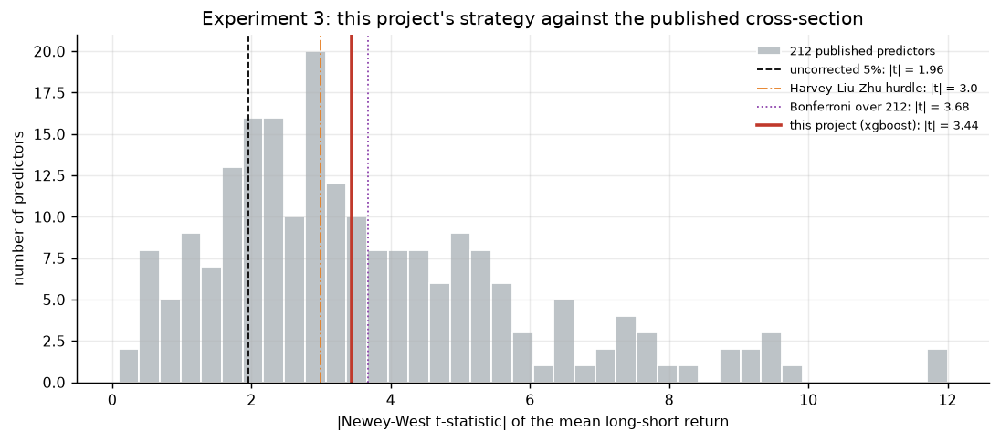

*This project's t-statistic against the distribution of 212 published predictors*


Note also that this project is itself a search — 26
predictors, 7 models, several portfolio variants — which is
why the comparison is against the published distribution rather than against
zero.

---

## 7. Experiment 4 — do asset-pricing tests behave with many assets?

### 7.1 The hypothesis was wrong

The premise was that the Gibbons-Ross-Shanken test degrades as *N/T* → 1,
because it inverts an *N* × *N* residual covariance matrix estimated from *T*
observations. A test was written asserting exactly that. It failed, and it
failed for a reason worth stating: **GRS is exact in finite samples** under its
assumptions — normal, homoskedastic, serially independent residuals with *any*
cross-sectional covariance — for every *N* ≤ *T* − *K* − 1. Dimension alone does
not distort it.

So the experiment was rebuilt around the right question: real returns satisfy
none of those assumptions, so how does each test behave once the errors are
allowed to look like the errors in the data? Six error structures, calibrated to
the panel: implied Student-*t* degrees of freedom
7.3, log-volatility persistence
0.66, mean pairwise residual correlation
0.048.

### 7.2 Empirical size, nominal 5%, T = 360

| error_model / n_assets                         |   grs |   wald_chi2 |   grs_shrunk |   pesaran_yamagata |
|:-----------------------------------------------|------:|------------:|-------------:|-------------------:|
| error_model=common_vol, n_assets=10            | 0.043 |       0.060 |        0.033 |              0.067 |
| error_model=common_vol, n_assets=25            | 0.050 |       0.113 |        0.017 |              0.090 |
| error_model=common_vol, n_assets=50            | 0.053 |       0.233 |        0.000 |              0.117 |
| error_model=common_vol, n_assets=100           | 0.033 |       0.753 |        0.000 |              0.180 |
| error_model=common_vol, n_assets=200           | 0.050 |       1.000 |        0.000 |              0.170 |
| error_model=common_vol, n_assets=300           | 0.053 |       1.000 |        0.000 |              0.220 |
| error_model=empirical_wild, n_assets=10        | 0.037 |       0.063 |        0.027 |              0.080 |
| error_model=empirical_wild, n_assets=25        | 0.060 |       0.113 |        0.020 |              0.107 |
| error_model=empirical_wild, n_assets=50        | 0.043 |       0.253 |        0.003 |              0.137 |
| error_model=empirical_wild, n_assets=100       | 0.020 |       0.817 |        0.000 |              0.133 |
| error_model=empirical_wild, n_assets=200       | 0.037 |       1.000 |        0.000 |              0.190 |
| error_model=empirical_wild, n_assets=300       | 0.037 |       1.000 |        0.000 |              0.210 |
| error_model=empirical_wild_block, n_assets=10  | 0.050 |       0.070 |        0.037 |              0.117 |
| error_model=empirical_wild_block, n_assets=25  | 0.080 |       0.167 |        0.033 |              0.093 |
| error_model=empirical_wild_block, n_assets=50  | 0.057 |       0.330 |        0.003 |              0.127 |
| error_model=empirical_wild_block, n_assets=100 | 0.063 |       0.780 |        0.000 |              0.183 |
| error_model=empirical_wild_block, n_assets=200 | 0.073 |       1.000 |        0.000 |              0.263 |
| error_model=empirical_wild_block, n_assets=300 | 0.060 |       1.000 |        0.000 |              0.257 |
| error_model=gaussian, n_assets=10              | 0.043 |       0.070 |        0.037 |              0.067 |
| error_model=gaussian, n_assets=25              | 0.050 |       0.113 |        0.030 |              0.083 |
| error_model=gaussian, n_assets=50              | 0.057 |       0.270 |        0.007 |              0.100 |
| error_model=gaussian, n_assets=100             | 0.053 |       0.753 |        0.000 |              0.130 |
| error_model=gaussian, n_assets=200             | 0.057 |       1.000 |        0.000 |              0.207 |
| error_model=gaussian, n_assets=300             | 0.053 |       1.000 |        0.000 |              0.223 |
| error_model=gaussian_independent, n_assets=10  | 0.040 |       0.040 |        0.033 |              0.047 |
| error_model=gaussian_independent, n_assets=25  | 0.057 |       0.097 |        0.030 |              0.053 |
| error_model=gaussian_independent, n_assets=50  | 0.063 |       0.287 |        0.017 |              0.070 |
| error_model=gaussian_independent, n_assets=100 | 0.040 |       0.800 |        0.000 |              0.053 |
| error_model=gaussian_independent, n_assets=200 | 0.053 |       1.000 |        0.000 |              0.050 |
| error_model=gaussian_independent, n_assets=300 | 0.070 |       1.000 |        0.000 |              0.073 |
| error_model=student_t, n_assets=10             | 0.017 |       0.020 |        0.007 |              0.057 |
| error_model=student_t, n_assets=25             | 0.053 |       0.103 |        0.027 |              0.100 |
| error_model=student_t, n_assets=50             | 0.030 |       0.213 |        0.000 |              0.090 |
| error_model=student_t, n_assets=100            | 0.040 |       0.767 |        0.000 |              0.147 |
| error_model=student_t, n_assets=200            | 0.040 |       1.000 |        0.000 |              0.147 |
| error_model=student_t, n_assets=300            | 0.047 |       1.000 |        0.000 |              0.233 |

| test             |   nominal_size |   worst_size | at_error_model       |   at_n_assets |   at_n_obs |   at_ratio_n_over_t |   median_size_over_grid |   median_size_adjusted_power |
|:-----------------|---------------:|-------------:|:---------------------|--------------:|-----------:|--------------------:|------------------------:|-----------------------------:|
| grs              |          0.050 |        0.080 | empirical_wild_block |            25 |        360 |               0.069 |                   0.050 |                        0.207 |
| wald_chi2        |          0.050 |        1.000 | gaussian             |           100 |        120 |               0.833 |                   0.572 |                        0.207 |
| grs_shrunk       |          0.050 |        0.037 | empirical_wild_block |            10 |        120 |               0.083 |                   0.000 |                        0.210 |
| pesaran_yamagata |          0.050 |        0.283 | empirical_wild_block |           300 |        120 |               2.500 |                   0.117 |                        0.135 |

**GRS holds its size everywhere**, at up to
*N/T* = 0.83, under heavy tails, under a
persistent common volatility factor, and under residual vectors resampled from
the real panel. Its median size over the grid is
0.050.

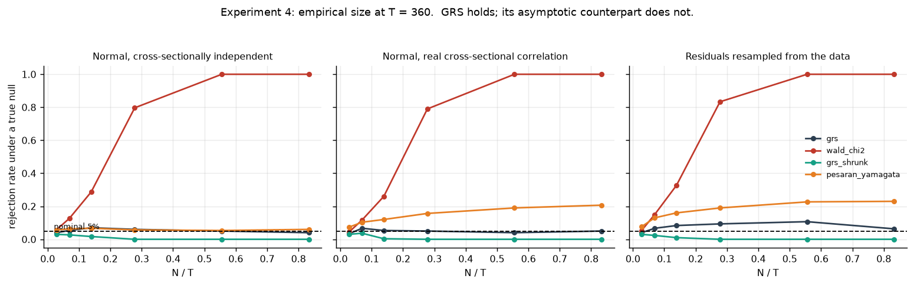

*Empirical size against N/T under three error structures. GRS is flat at 5%; its asymptotic counterpart is not.*


**What actually breaks:**

- *The asymptotic version of the same statistic.* Referring the identical
  quadratic form to χ²(*N*) instead of the exact *F* gives size
  0.070 at *N* = 10,
  0.270 at *N* = 50,
  0.753 at *N* = 100 and
  1.000 at *N* = 200. The finite-sample
  correction is doing all the work.
- *Shrinkage without recalibration.* A Ledoit-Wolf covariance conditions better
  and shrinks the statistic, but the *F* critical value is unchanged, so size
  collapses to 0.000 at *N* = 100 and the
  test stops rejecting anything. Better estimation is not automatically better
  inference.
- *The large-N test's assumption.* Pesaran-Yamagata never inverts an *N* × *N*
  matrix and is correctly sized under cross-sectional independence
  (0.073 at *N* = 300).
  Under the correlation these portfolios actually have, its size rises to
  0.257 — and rises
  *with N*, the opposite of what an asymptotic-in-*N* test should do.

### 7.3 Existence, not size, is the binding constraint on GRS

| n_obs / n_assets        |   grs |   grs_shrunk |   pesaran_yamagata |   wald_chi2 |
|:------------------------|------:|-------------:|-------------------:|------------:|
| n_obs=120, n_assets=10  |  1.00 |         1.00 |               1.00 |        1.00 |
| n_obs=120, n_assets=25  |  1.00 |         1.00 |               1.00 |        1.00 |
| n_obs=120, n_assets=50  |  1.00 |         1.00 |               1.00 |        1.00 |
| n_obs=120, n_assets=100 |  1.00 |         1.00 |               1.00 |        1.00 |
| n_obs=120, n_assets=200 |  0.00 |         0.00 |               1.00 |        0.00 |
| n_obs=120, n_assets=300 |  0.00 |         0.00 |               1.00 |        0.00 |
| n_obs=360, n_assets=10  |  1.00 |         1.00 |               1.00 |        1.00 |
| n_obs=360, n_assets=25  |  1.00 |         1.00 |               1.00 |        1.00 |
| n_obs=360, n_assets=50  |  1.00 |         1.00 |               1.00 |        1.00 |
| n_obs=360, n_assets=100 |  1.00 |         1.00 |               1.00 |        1.00 |
| n_obs=360, n_assets=200 |  1.00 |         1.00 |               1.00 |        1.00 |
| n_obs=360, n_assets=300 |  1.00 |         1.00 |               1.00 |        1.00 |

At *T* = 120 the statistic simply does not exist for the
largest cross-sections, since it
requires *T* > *N* + *K*. Pesaran-Yamagata is always defined. So the real
trade-off is not about dimension in the abstract: **GRS needs *N* < *T*;
Pesaran-Yamagata needs weak cross-sectional dependence.** Equity portfolios
violate the second and modern cross-sections violate the first.

### 7.4 Size-adjusted power

Raw power cannot be compared across tests whose sizes differ — a test that
rejects a true null 100% of the time also "detects" mispricing 100% of the time
while knowing nothing. Power is therefore also measured at critical values
calibrated from each cell's own null distribution, against a true alpha
dispersion of 0.6% a year (chosen
small enough that no test can see it one asset at a time).

Under weak dependence, Pesaran-Yamagata's power grows with *N* and overtakes
GRS. Under real dependence it flattens out while GRS's keeps rising — cross
sectional correlation *increases* the power of a joint alpha test, because the
common component can be hedged out and the mispricing portfolio has a higher
Sharpe ratio. Full grid in `results/exp4_size_adjusted_power.csv`.

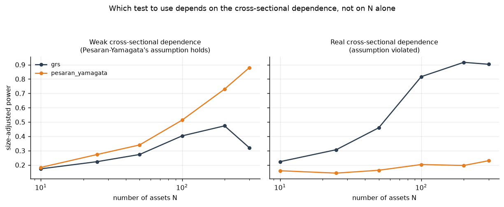

*Size-adjusted power against N, with and without real cross-sectional dependence*


### 7.5 The same tests on the real panel

| n_obs / n_assets        |   grs_reject_rate |   wald_chi2_reject_rate |   grs_shrunk_reject_rate |   pesaran_yamagata_reject_rate |
|:------------------------|------------------:|------------------------:|-------------------------:|-------------------------------:|
| n_obs=120, n_assets=10  |             0.025 |                   0.100 |                    0.025 |                          0.050 |
| n_obs=120, n_assets=25  |             0.075 |                   0.300 |                    0.000 |                          0.025 |
| n_obs=120, n_assets=50  |             0.100 |                   0.975 |                    0.000 |                          0.000 |
| n_obs=120, n_assets=100 |             0.125 |                   1.000 |                    0.000 |                          0.000 |
| n_obs=120, n_assets=200 |           nan     |                 nan     |                  nan     |                          0.000 |
| n_obs=120, n_assets=300 |           nan     |                 nan     |                  nan     |                          0.000 |
| n_obs=120, n_assets=374 |           nan     |                 nan     |                  nan     |                          0.000 |
| n_obs=240, n_assets=10  |             0.150 |                   0.225 |                    0.075 |                          0.125 |
| n_obs=240, n_assets=25  |             0.350 |                   0.525 |                    0.050 |                          0.200 |
| n_obs=240, n_assets=50  |             0.425 |                   0.925 |                    0.075 |                          0.375 |
| n_obs=240, n_assets=100 |             0.625 |                   1.000 |                    0.000 |                          0.575 |
| n_obs=240, n_assets=200 |             0.600 |                   1.000 |                    0.000 |                          0.800 |
| n_obs=240, n_assets=300 |           nan     |                 nan     |                  nan     |                          0.975 |
| n_obs=240, n_assets=374 |           nan     |                 nan     |                  nan     |                          1.000 |
| n_obs=480, n_assets=10  |             0.625 |                   0.650 |                    0.600 |                          0.675 |
| n_obs=480, n_assets=25  |             0.925 |                   0.950 |                    0.850 |                          0.875 |
| n_obs=480, n_assets=50  |             0.975 |                   1.000 |                    0.875 |                          0.975 |
| n_obs=480, n_assets=100 |             1.000 |                   1.000 |                    0.975 |                          1.000 |
| n_obs=480, n_assets=200 |             1.000 |                   1.000 |                    0.250 |                          1.000 |
| n_obs=480, n_assets=300 |             1.000 |                   1.000 |                    0.000 |                          1.000 |
| n_obs=480, n_assets=374 |             1.000 |                   1.000 |                    0.000 |                          1.000 |
| n_obs=654, n_assets=10  |             0.775 |                   0.775 |                    0.700 |                          0.725 |
| n_obs=654, n_assets=25  |             0.950 |                   0.950 |                    0.875 |                          0.900 |
| n_obs=654, n_assets=50  |             1.000 |                   1.000 |                    1.000 |                          1.000 |
| n_obs=654, n_assets=100 |             1.000 |                   1.000 |                    1.000 |                          1.000 |
| n_obs=654, n_assets=200 |             1.000 |                   1.000 |                    1.000 |                          1.000 |
| n_obs=654, n_assets=300 |             1.000 |                   1.000 |                    0.900 |                          1.000 |
| n_obs=654, n_assets=374 |             1.000 |                   1.000 |                    0.000 |                          1.000 |

Over the full sample GRS rejects the six-factor model for essentially every
subset with *N* ≥ 50. The simulation is what licenses reading that as genuine
mispricing rather than size distortion — without it, the rejection and a broken
test are indistinguishable. Note that `grs_shrunk` rejects nothing at large *N*,
exactly as its simulated size predicts.

### 7.6 Three resampling errors and how they were diagnosed

Each of these produced a plausible number rather than an error.

1. *An undemeaned residual pool.* The bootstrap pool's column means were not
   zero, planting roughly 2% a year of alpha. Every test correctly rejected a
   null that was in fact false.
2. *Resampling months with replacement.* Repeats months, so the covariance is
   estimated from fewer distinct observations than the nominal *T*. Size reached
   0.78 and looked like a dramatic result about real returns.
3. *Resampling without replacement.* Fixes the duplication and introduces the
   opposite error — the finite-population correction shrinks the variance of the
   estimated intercept — so size fell to 0.000.

The fix was a wild bootstrap: real residual vectors with random sign flips. No
month is duplicated, sign flips leave second moments untouched so the variance
of the intercept estimate is exactly what the test assumes, the null holds
exactly, and each month keeps its own magnitude and cross-sectional pattern.
All three are now regression tests in `tests/test_montecarlo.py`.

---

## 8. What would change these conclusions

- **Firm-level data.** The universe, not the model class, is the binding
  constraint. The claim that flexibility adds little would be worth revisiting
  on a panel where interactions between accounting characteristics exist to be
  found.
- **Costs optimised rather than measured.** The accuracy and net-performance
  rankings already disagree, so optimising against a turnover penalty would
  plausibly change the model ranking more than any change to the models.
- **The decay.** Distinguishing arbitrage from overfitting would need a design
  that exploits variation in when each relation became widely known — for
  instance, whether decay is faster for predictors that received more academic
  attention.
- **Impact modelling.** A flat basis-point rate ignores market impact, which
  scales with size. The break-even figures should be read as generous.

## 9. Reproducing this

```bash
pip install -r requirements.txt
make test     # 78 test functions
make all      # full pipeline, then regenerates this report
```

`tests/test_no_lookahead.py` checks the point-in-time and embargo guarantees
the results above depend on; `tests/test_montecarlo.py` encodes the three
simulation bugs of §7.6 as regression tests.

Raw inputs are pinned to immutable commits with SHA-256 digests in
`data/raw/manifest.json`. This matters because the Fama-French library is
revised retroactively whenever CRSP is updated, so an unpinned download would
silently change every number above.
